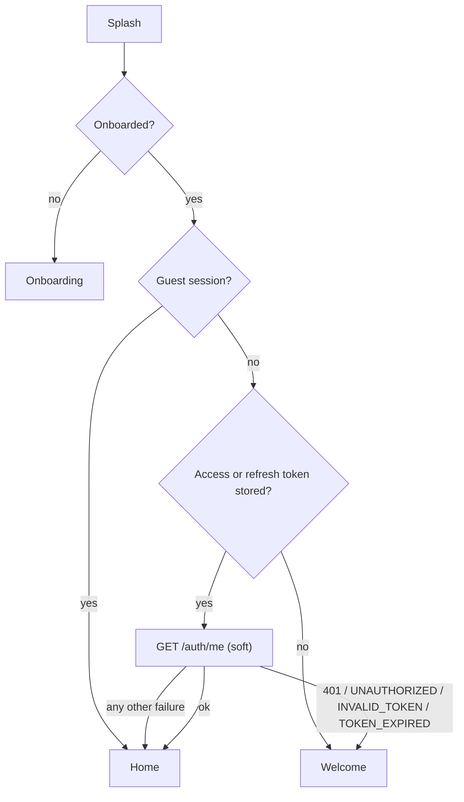
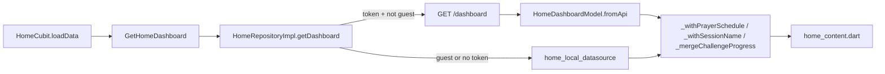

# Pages data map — every screen, every field, every source

**Audience:** Flutter + backend teams
**App:** Noor Flutter (`lib/`)
**Base URL:** `https://noor-app-backend-one.vercel.app/api/v1`
**Updated:** 2026-08-30

This file is **page-first**: for each screen it lists every visible field, where that value actually comes from at runtime, what the backend does not send, and which values are parsed but never shown. The endpoint-first view lives in [BACKEND_DATA_CONTRACT.md](./BACKEND_DATA_CONTRACT.md).

Related: [FLUTTER_INTEGRATION_GUIDE.md](./FLUTTER_INTEGRATION_GUIDE.md), [FLUTTER_ADHKAR_INTEGRATION_GUIDE.md](./FLUTTER_ADHKAR_INTEGRATION_GUIDE.md), [QURAN_OFFLINE_INTEGRATION_GUIDE.md](./QURAN_OFFLINE_INTEGRATION_GUIDE.md), [AZAN_FEATURE.md](./AZAN_FEATURE.md), [HOME_WIDGETS.md](./HOME_WIDGETS.md).

---

## 0) How to read this file

Every table row cites `file:line` in `lib/`. Arabic literals are quoted verbatim exactly as they appear in the Dart source.

### Source tags

| Tag | Meaning |
|-----|---------|
| `API` | Comes from an HTTP endpoint; the JSON key is given |
| `LOCAL-DB` | SQLite offline mushaf (`lib/features/quran/data/datasources/quran_offline_database.dart`) |
| `PREFS` | `SharedPreferences` via `LocalStorage` / `StorageKeys` |
| `CACHE` | JSON response cache (`JsonCacheStore`), used as offline fallback |
| `SENSOR` | Device GPS / magnetometer |
| `L10N` | Localization string (`lib/l10n/app_*.arb`) |
| `HARDCODED` | Dart literal in the app — will never change unless we ship a release |
| `MOCK` | `QuranMockData` / `home_local_datasource.dart` fake data reachable in production |
| `DEAD` | Parsed from the API but never rendered anywhere |

### Reading the "fallback chain"

`API → CACHE → MOCK` means: try the network, then today's cache, then fake data. Anywhere `MOCK` appears in a chain, the user can be shown plausible but wrong numbers with no error indication. Those cases are listed in §8.

---

## 1) Global plumbing (applies to every page)

### Network

- Base URL and timeouts: `lib/core/network/api_config.dart:4-6` — hardcoded URL, 20s connect and 20s receive. There is no `--dart-define` or environment switch, so staging/production cannot be swapped without a code change.
- Every response must be a JSON object envelope; `_unwrap` throws when `success == false` (`lib/core/network/api_client.dart:311-320`).
- Errors become `ApiException` carrying `message`, `code`, `statusCode`, `details`, and Zod-style field `errors` (`api_client.dart:322-349`).
- Auth header injected unless the request sets `extra['skipAuth']` (`api_client.dart:63-75`). Public endpoints today: `/auth/*`, `GET /adhkar`, `GET /adhkar/categories/:KEY`, `GET /qibla/calculate`.
- 401 handling (`api_client.dart:77-186`): code `INVALID_TOKEN` clears tokens and fires `onSessionExpired` immediately; any other 401 attempts one `POST /auth/refresh` and replays the request with `extra['retried'] = true`. Tokens are only purged when the refresh call itself returns 400/401/403, so network blips do not log the user out. Concurrent refreshes are deduped through a single `Completer`.
- Byte downloads support HTTP Range resume (`api_client.dart:214-239`) — used by the offline mushaf download.

### Offline and failure surfacing

- `lib/core/widgets/offline_banner.dart:21,46-78` renders an amber "offline" pill while disconnected and a green "back online" pill for 2 seconds after reconnect.
- Repositories map API errors to `ServerFailure` and everything else to `NetworkFailure`, falling back to a cache where one exists.
- Writes that fail are queued in `lib/core/storage/offline_outbox.dart` and replayed by `outbox_sync_service.dart`. Consequence: several screens report "saved" when nothing reached the server (see §8).

### Guest sessions

`GuestAccess.peekIsGuest()` gates many repositories. Guests never hit `/dashboard`, `/notifications`, or `/profile/*`; they get local mock/empty data instead. This is the single biggest reason a screen can look "empty for no reason" — check the session type first.

### Cross-page state

- `HomeCubit` owns the dashboard and is read by the Quran browse header too, so a bad `/dashboard` response degrades two screens.
- `NavCubit` drives the 5 bottom tabs; tabs are `SizedBox.shrink()` until first visited (`lib/features/home/presentation/pages/home_page.dart:67-85`).

---

## 2) Entry and auth pages

### 2.1 Splash — `lib/features/splash/presentation/pages/splash_page.dart`

| Field | Line | Source | Notes |
|---|---|---|---|
| Noor logo (dark, size 90) | 74 | `HARDCODED` | No title variant |
| Tagline | 77 | `L10N` `splashTagline` | — |
| Background pattern + `AppColors.navyDeep` | 62, 65 | `HARDCODED` | — |
| Fade + scale animation, 1000ms | 30-38 | `HARDCODED` | `FlutterNativeSplash.remove()` at line 29 |

Routing: `SplashCubit.init()` waits a fixed 900ms (`splash_cubit.dart:11,18`) then runs `ResolveInitialRoute`:



`resolve_initial_route.dart:33-73`. Only a definitive auth rejection logs the user out; network errors keep the session. `ResolveInitialRouteParams` (`:81-86`) is dead code.

**Backend needs:** none.

### 2.2 Onboarding — `lib/features/onboarding/presentation/pages/onboarding_page.dart`

Zero backend involvement. All three pages come from the const `kOnboardingPages` (`lib/features/onboarding/data/models/onboarding_model.dart:25-44`) served by `onboarding_local_datasource.dart:9`.

| Field | Line | Source |
|---|---|---|
| Page image | 171-178 | `HARDCODED` `AppAssets.onboarding1/2/3`, with `IconData` fallback (`mosque`, `apps`, `emoji_events`) if the asset fails |
| Title / subtitle | 183, 189 | `L10N` `onboardingPage{1,2,3}Title/Subtitle` via `l10n.onboardingString(...)` |
| Skip button, page indicator, Next/Start button | 82-128 | `L10N` + `HARDCODED` gold active dots |
| Shimmer empty state | 77 | Unreachable — the page list is a compile-time constant |

### 2.3 Shared auth data layer

All five auth pages use `AuthCubit` and `AuthRemoteDataSourceImpl` (`lib/features/auth/data/datasources/auth_remote_datasource.dart`). Everything is `skipAuth: true` except `getMe`.

| Action | Endpoint | Request body | Line |
|---|---|---|---|
| Login | `POST /auth/login` | `email`, `password` | 54-58 |
| Sign up | `POST /auth/sign-up` | `fullName`, `email`, `password` | 72-79 |
| Google | `POST /auth/google` | `idToken` | 102-106 |
| Profile | `GET /auth/me` | — | 120 |
| Logout | `POST /auth/logout` | `refreshToken` | 134-138 |
| Forgot | `POST /auth/forgot-password` | `email` | 160-164 |
| Reset | `POST /auth/reset-password` | `token`, `newPassword` | 176-180 |

Responses are parsed from `data.user` plus `extractAuthTokens(data)`, and tokens are persisted before the user model is returned (`_parseAuthPayload`, `:187-207`).

### 2.4 Welcome — `lib/features/auth/presentation/pages/welcome_page.dart`

| Field | Line | Source |
|---|---|---|
| Logo (size 80) | 37 | `HARDCODED` |
| Title / subtitle | — | `L10N` `welcomeTitle`, `welcomeSubtitle` |
| "Create account" / "Login" buttons | 37-95 | `L10N` |
| "Continue as guest" rich text (3 spans) | 70 | `L10N`; calls `AuthCubit.continueAsGuest()` — local session write, no network |

Any success state pushes to home (`:22-24`).

### 2.5 Login — `lib/features/auth/presentation/pages/login_page.dart`

| Field | Line | Source | Notes |
|---|---|---|---|
| Logo, `loginTitle` | — | `L10N` | — |
| Email field hint | 71 | `HARDCODED` `AhmedMohamed@gmail.com`, forced LTR | Should arguably be an l10n placeholder |
| Password field hint | — | `HARDCODED` `••••••••` | — |
| Email / password inline errors | 73, 84 | `state.emailError` / `passwordError` message keys via `context.localizeMessage` | — |
| Server error | 40-51 | `API` error `message` in a 4s `SnackBar`, then `resetStatus()` | — |
| Button spinners | 90, 116 | `state.loadingSource` distinguishes email vs Google | — |

Note: three consecutive 401s synthesize a local `tooManyAttempts` message even without a 429 (`auth_cubit.dart:124-138`).

### 2.6 Sign up — `lib/features/auth/presentation/pages/signup_page.dart`

Same shell plus a name field (`signupNameLabel` / `signupNameHint`, `:71-78`).

Client validation `_validateSignUp` (`:331-364`): name ≥ 2 chars, email regex `^[\w.-]+@[\w-]+\.\w+$` (`:40`), password via `PasswordRules.isValidSignupPassword`.

Server Zod field errors are mapped back onto the right inputs (`:308-312`): `fullName`/`name` → name, `email` → email, `password`/`newPassword` → password, `token` → token. **Backend must keep using these exact `errors[].field` names** or inline errors go silent.

### 2.7 Forgot password — `lib/features/auth/presentation/pages/forgot_password_page.dart`

| Field | Line | Source |
|---|---|---|
| Back arrow app bar, logo | — | `HARDCODED` |
| Title / subtitle / check-email hint | — | `L10N` `forgotPasswordTitle`, `forgotPasswordSubtitle`, `forgotPasswordCheckEmail` |
| Email field, submit | — | user input |
| "I have a code" button → reset page | 115-124 | `L10N` |

On success it shows `forgotPasswordSent` and intentionally stays on the screen (`:45`).

### 2.8 Reset password — `lib/features/auth/presentation/pages/reset_password_page.dart`

| Field | Line | Source |
|---|---|---|
| Token field | 107-141 | user input, or seeded from a deep link (`lib/app/app_router.dart:101-108` → `initState` post-frame, `:31-38`) |
| New password / confirm password | 107-141 | user input |
| Submit | — | `POST /auth/reset-password` |

Confirm-password mismatch is validated client-side only (`auth_cubit.dart:426-429`); there is no `confirmPassword` key in the request body. Success shows a snackbar then pushes to login (`:56-63`).

**Nothing in the auth flow is stubbed.** Google sign-in raises distinct message keys for a cancelled flow and a missing ID token (`auth_remote_datasource.dart:91-100`).

---

## 3) Home

### 3.1 Shell — `lib/features/home/presentation/pages/home_page.dart`

Renders no data itself: an `OfflineBanner` plus an `IndexedStack` of 5 lazily built tabs (`:104-114`, `_tabChild` `:67-85`) — 0 `HomeContent`, 1 `QuranPage`, 2 `AzkarPage`, 3 `JourneyPage`, 4 `AccountPage`. `HomeCubit.refresh()` fires on app resume (`:56`) and on locale change (`:93`); `loadData()` runs once at provider creation (`lib/app/app_router.dart:116`).

### 3.2 Data flow



### 3.3 Sections — `lib/features/home/presentation/widgets/home_content.dart`

Gating: shimmer while `loading`/`initial` (`:70-73`); error + retry when `status == error` **or** `dashboard == null` (`:75-93`). Rebuild filter `buildWhen` uses `!a.sameAsideFromCountdown(b)` (`:58-68`).

| # | Section | Widget line | Field | Source (JSON key on `GET /dashboard` → `data`) |
|---|---|---|---|---|
| 1 | Header | 112, 326 | Hijri date | `API` `greeting.weekdayName` + `' '` + `greeting.hijriDate` (`home_dashboard_model.dart:76-78`) |
| | | 355 | Greeting + user name | `API` `greeting.displayName` ?? `greeting.fullName` ?? `''` (`:96`), then overridden by session name or `guestName` (`home_repository_impl.dart:279-297`) |
| | | 362, 433 | Points chip | `API` `greeting.points` ?? 0 (`:98`), then `max(api, local balance)` (`repo:210-232`) |
| | | 367 | Notifications bell | `GET /notifications/unread-count` (see §6.5) |
| 2 | Guest banner | 117, 234 | — | `PREFS` guest flag + dismissed flag |
| 3 | Prayer card | 504, 508 | Next prayer name / time | `API` `prayers.nextPrayer.nameAr` / `.time` (`:100-101`) — **then discarded and recomputed locally** (`repo:263-269`) |
| | | 487-489 | Countdown | `API` `prayers.nextPrayer.countdownSeconds` (`:102-103`) — also discarded; ticked locally each second (`home_cubit.dart:153-177`) and triggers `refresh()` at zero |
| | | 554, 562, 525-549 | Per-prayer name / time / dot state | `API` `prayers.schedule[]` `nameAr`, `time`, `completed` (`:106-114`); `isNext` = `schedule[i].name == nextPrayer.name`; both flags then overwritten by device-clock comparison (`prayer_schedule.dart:54-71`) |
| 4 | Ayah of the day | 610, 622 | Text / reference | `API` `verseOfTheDay.textAr` / `.referenceAr` (`:104-105`) |
| 5 | Journey grid (2×2) | 656, 674-816 | prayer tile | `API` `dailyJourney.prayer.completed` / `.total` (default 5) / `.progress` (`:80-87,116-124`) |
| | | | quran tile | `API` `dailyJourney.quran.pagesRead` ?? 0 (`:88-89,125-133`); `done` hardcoded false then recomputed locally |
| | | | sadaqah tile | `API` `dailyJourney.sadaqah.amount` ?? 0 (`:92-93,134-142`) |
| | | | azkar tile | `API` `dailyJourney.adhkar.completed == true` (`:90-91,143-151`) |
| | | 782, 795-804 | tile label / value / caption | `HARDCODED` Arabic literals — see §3.5 |
| 6 | Shortcuts row | 829 | Qibla, Misbaha | `HARDCODED` nav buttons, no data |
| 7 | Continue khatma | 906 | Surah name | `API` `khatmah.surahId` + `surahNameAr` → `resolveSurahNameAr` (`:925`) — local catalog wins |
| | | 931, 936 | Current page / progress | `API` `khatmah.currentPage`, `khatmah.progressPercent` (`:153-164`). **Whole card hidden if `khatmah` key absent** |
| 8 | Daily challenge | 1089-1258 | Title / target / reward / completed / claimed | `API` `dailyChallenge.titleAr`, `.targetValue`, `.rewardPoints`, `.completed`, `.claimed` (`:165-174`), OR-ed with the local challenge store (`repo:210-254`); `targetValue` defaults to 5 when ≤ 0. **Card hidden if key absent** |
| | | 1145 | Pages read | `max(api dailyJourney.quran.pagesRead, local store)` (`repo:210-232`) |
| 9 | Hadith | 1329, 1330 | Text / source | `API` `hadithOfTheDay.textAr` / `.sourceAr` (`:175-176`), with l10n fallbacks |

### 3.4 Prayer time resolution — `lib/features/home/domain/prayer_schedule.dart`

`resolve` (`:23-88`) parses each `time` into a `DateTime` (`_parsePrayerDateTime`, `:99-131`), picks the first future entry as next, wraps to tomorrow's index 0 if all have passed, and marks earlier entries completed.

AM/PM heuristic (`:121-128`): after stripping `م`/`ص`/AM/PM, when no meridiem marker is present **index 0 is treated as AM and indexes 1+ get +12h**. This assumes `schedule` is exactly Fajr, Dhuhr, Asr, Maghrib, Isha in that order. `_displayTime` (`:144-163`) re-appends `ص` for index 0 and `م` otherwise. Sending 24h `HH:mm` or ISO removes this guesswork.

### 3.5 Hardcoded in the Home parser (never from backend)

`home_dashboard_model.dart:116-151` — all four journey tiles:

| Tile | `id` | `label` | `caption` | `colorKey` |
|---|---|---|---|---|
| prayer | `prayer` | `'الصلاة'` | `'صلوات مكتملة'` | `green` |
| quran | `quran` | `'القرآن'` | `'صفحات اليوم'` | `blue` |
| sadaqah | `sadaqah` | `'الصدقة'` | `'مساهمة اليوم'` | `purple` |
| azkar | `azkar` | `'الأذكار'` | `'أحسنت الاستمرار'` / `'لم يكتمل بعد'` | `gold` |

These stay Arabic in the English locale. `colorKey` is never read by the UI (`_styleFor` switches on `id`). Azkar `value` is the literal `'تم الإنجاز'` / `'0'` (`:146-147`). Quran tile `progress` divides by a hardcoded 5 (`:132`).

### 3.6 Mock dashboard reachable in production

`lib/features/home/data/datasources/home_local_datasource.dart:18-133` returns a fully fake dashboard: fixed prayer times 4:11 / 12:58 / 4:34 / 8:00 / 9:34, a fixed ayah and hadith, khatmah surah 1 page 1, a "5 pages / 50 points" challenge, and azkar `done: true`. Used when there is no token, the session is a guest, or an `ApiException` occurs with no same-day cache (`home_repository_impl.dart:98-99, 109-110`).

### 3.7 Dead / overridden on Home

| Field | Status |
|---|---|
| `nextPrayerName`, `nextPrayerTime`, `countdown`, `countdownSeconds` | Parsed then **unconditionally discarded** (`repo:263-269`) |
| `prayers[].completed`, `isNext` | Parsed then overwritten by device clock |
| `dailyChallenge.descriptionAr` | Parsed, never rendered on Home |
| `JourneyTaskEntity.colorKey` | Never read |
| `khatmah.surahNameAr` | Replaced by the local surah catalog |
| `data.utilities` (per contract) | Not read at all |

### 3.8 Backend needs for Home

1. Always send a full `prayers.schedule` array of 5 entries with `nameAr`, `name`, and `time` in 24h `HH:mm` or ISO.
2. Send `dailyJourney.prayer.progress` as a **fraction** (`0.4`), and keep it consistent with `completed`/`total`.
3. Send `dailyJourney.adhkar.completed` as a real JSON boolean.
4. Localized journey labels/captions (`labelAr`/`labelEn`, `captionAr`/`captionEn`) so the grid can stop hardcoding Arabic.
5. Always include `khatmah` and `dailyChallenge` keys (nullable is fine, but absence silently removes a whole card).

---

## 4) Quran

### 4.1 Browse — `lib/features/quran/presentation/pages/quran_page.dart`

| Field | Line | Source | Fallback chain |
|---|---|---|---|
| Hijri date line | 70, rendered `quran_browse_header.dart:29` | `API` `GET /dashboard` `hijriDate` | → `HARDCODED` `'السبت 15 ذو القعدة'` |
| Greeting + first name | 61-70 | `API` dashboard `userName` | → `L10N` `homeDefaultUserName` |
| Search / history icons | 74-76 | open sheets below | — |
| Offline mushaf download card | 81-85, `mushaf_offline_download_card.dart` | `MushafDownloadCubit` → `isMushafDownloadComplete()` / `downloadMushaf()`; `GET /quran/full-catalog` into SQLite (`quran_offline_database.dart:369`) | — |
| Segmented tabs (Juz / Surahs / Favorites) | 90-96 | `L10N` | — |
| Juz rows: `nameAr`, `nameEn` | 192-196, `juz_list_tile.dart:40-50` | `API` `GET /quran/juz` — keys `juzNumber, nameAr, nameEn, totalAyahs, startPage, endPage, firstSurah.id` (`quran_models.dart:77-91`) | → `CACHE` → **`MOCK`** `QuranMockData.juzList` (`quran_repository_impl.dart:67`) |
| Surah rows: number, `nameAr`, Makki/Madani badge | 229-232, `surah_list_tile.dart:23,36,60` | `LOCAL-DB` `cached_surah_meta` when the catalog is complete (`repo:80-84`) → `CACHE` → `API` `GET /quran/surahs` | → **`MOCK`** `QuranMockData.surahList` (`repo:96`). Name always re-resolved through `resolveSurahNameAr` |
| Favorites cards: surah name, ayah text, note, ayah/page label, heart | 269-296, `favorite_ayah_card.dart:72-178` | `API` `GET /quran/bookmarks` merged with local `local_` bookmarks (`repo:437-458`) — keys `id, surahId, ayahNumber, page, textAr, note, surahNameAr` or `surah.nameAr` (`quran_models.dart:244-260`) | — |
| Favorites empty state | 260-266 | `L10N` `quranFavoritesEmpty` | — |
| Error body | 131-157 | **Raw `e.toString()`** from `quran_cubit.dart:85` | — |

**Search sheet** (`quran_search_sheet.dart`): `GET /quran/search?q=&limit=`; ayah text plus `resolveSurahNameAr(ayah.surahId)` (`:194`), ignoring any server-provided name. The response shape is not pinned by the contract, so three shapes are accepted (`quran_remote_datasource.dart:328-334`) and an unknown fourth shape returns empty instead of erroring.

**History sheet** (`quran_history_sheet.dart`): `GET /quran/last-read` + bookmarks. Subtitles are hardcoded English: `'p. ${page} · ayah ${n}'` (`:104-106`) and `'p. ${page}'` (`:154`).

### 4.2 Reader — `lib/features/quran/presentation/pages/quran_reader_page.dart`

| Field | Line | Source |
|---|---|---|
| Header surah name, juz label, page number (Arabic-Indic) | 336-339, `_ReaderTitle:570-597` | Derived from page blocks; juz label is **always local** `QuranMockData.juzLabelAr` (`repo:53`) |
| Mushaf body: surah headers, bismillah, ayah text, ayah markers | `_PageBody:762`, `_ScrollBody:1139`, blocks at `quran_models.dart:362-427` | `API` `GET /quran/pages/:page` → memory cache → `LOCAL-DB` `pages` table → `pageFromCatalog` (`quran_offline_database.dart:419`). Keys: `page, totalPages, ayahs[{id,surahId,ayahNumber,textAr,page,juz}], surahs[]` |
| Bismillah line | 428, 488 | `L10N` `quranBismillah` + `SurahOpeningHeader.shouldShowFor` |
| Bookmark icon / ayah highlight | 361-366 | `API` `GET /quran/bookmarks` (`quran_reader_cubit.dart:633-655`) |
| Reading mode, reader theme, auto-scroll speed | 125-168 | `PREFS` `quranReadingMode`, `quranReaderTheme`, `quranAutoScrollSpeed` (`quran_reader_cubit.dart:694-709`). The auto-scroll **enabled** flag is not persisted (`:445`) |
| Font size | 170-207 | `API` `GET/PATCH /profile/reading-preferences` `quranFontSize`, cached locally |
| Reciter / Tafsir / Translation dropdowns | 208-245; option lists **hardcoded** at 67-79 | `API` `quranReciter`, `quranTafsir`, `quranTranslation` from `/profile/reading-preferences`. Play and tafsir buttons are `showComingSoonSnackBar` (`:215-231`) — no audio or tafsir endpoint exists. An unknown server value is silently rewritten to `items.first` (`:1335`) |
| "Offline needed" error | 397-419 | `L10N` `quranOfflineNeeded`. The reader never falls back to mock — `repo:398-403` throws `QURAN_PAGE_UNAVAILABLE` |

### 4.3 Juz surahs — `lib/features/quran/presentation/pages/juz_surahs_page.dart`

| Field | Line | Source |
|---|---|---|
| Title | 79 | `JuzSurahsArgs.juzNameAr` passed from browse (API or mock juz name) |
| Surah rows: `id`, `nameAr`, `nameEn`, revelation badge, `startPage` | 110-135 | `API` `GET /quran/juz/:n/surahs` (`quran_remote_datasource.dart:94`) → `CACHE`. **On failure returns an empty list with no mock fallback** (`repo:119`), so the user sees a blank list instead of the retry button at `:95-107` |

Parsed but never displayed: `fromAyah`, `toAyah`, `ayahsInJuz`, `totalAyahs` (`quran_models.dart:145-149`).

### 4.4 Quran endpoints in use

`GET /quran/surahs`, `/quran/juz`, `/quran/juz/:n/surahs`, `/quran/juz/:n/ayahs`, `/quran/pages/:page`, `/quran/surahs/:id/ayahs?page=1&perPage=1`, `/quran/search`, `/quran/full-catalog` (Range resume), `/quran/bookmarks` (GET/POST/PATCH/DELETE), `/quran/last-read` (GET/PUT), `/quran/khatmah/stats`, `PATCH /quran/khatmah/progress`, `POST /quran/import-local`, `/profile/reading-preferences`, `POST /journey/quran-pages/increment`.

### 4.5 Backend needs for Quran

1. Pin the `GET /quran/search` response shape in the contract (currently three shapes are tolerated).
2. Audio recitation and tafsir endpoints — the reader UI already exists behind coming-soon snackbars, and the reciter/tafsir/translation option lists must come from the server rather than the hardcoded lists at `quran_reader_page.dart:67-79`.
3. Localized page/ayah labels are not needed from the API, but note the client currently ignores every server surah name (see §8).

---

## 5) Adhkar / Azkar

### 5.1 Home — `lib/features/azkar/presentation/pages/azkar_page.dart` (`GET /adhkar`, public)

| Field | Line | Source (`data`) |
|---|---|---|
| App bar title, search toggle | 61-74 | `L10N`. **Search is a client-side filter over the loaded list only** (`:124-131`) — there is no search endpoint |
| Guest banner | 165-173 | `GuestAccess.peekIsGuest()` |
| Greeting line | 119-123 | `API` `greeting` → `L10N` `azkarGreetingFallback`. **In the English locale the server value is discarded entirely** |
| Daily wird title | `_DailyWirdCard:310-314` | `API` `dailyWird.titleAr` (Arabic only; EN uses l10n) |
| Progress `x من y` | 344-347 | `API` `dailyWird.progressItemsDone` / `progressItemsTotal` |
| Progress bar | 365-370 | `API` `dailyWird.progressPercent` |
| CTA button | 315-318, 383 | `API` `dailyWird.ctaAr`; navigates with `dailyWird.categoryKey` |
| Category rows: label + icon | `_CategoryTile:399-431` | `API` `categories[]` `nameAr` / `nameEn` (`adhkar_ui.dart:12-18`), sorted by `sortOrder` (`adhkar_models.dart:17`). Icon = local SVG by key (`adhkar_category_icons.dart`), else the raw `iconCode` emoji |
| Search-empty text | 193-202 | `L10N` `azkarSearchEmpty` |

Model defaults that mask missing data (`adhkar_models.dart`): greeting `'واذكر ربك إذا نسيت'` (`:19`), `titleAr` `'وردك اليوم'` (`:55`), `progressItemsTotal` **8** (`:58`), `ctaAr` `'اكمل وردك اليوم'` (`:61`), `categoryKey` `'GENERAL_WIRD'` (`:63`), `iconCode` `'📖'` (`:114`), `sortOrder` **999** (`:115`).

### 5.2 Category — `lib/features/azkar/presentation/pages/azkar_category_page.dart` (`GET /adhkar/categories/:KEY`)

| Field | Line | Source |
|---|---|---|
| Title | 122-124 | `API` `nameAr` / `nameEn` |
| Dhikr body | 354 | `API` `items[i].textAr` |
| Fadilah line | 366-379 | `API` `items[i].benefitAr` (hidden when empty) |
| Repeat label + `taps/total` | 437-451 | `API` `items[i].repeatCount`; taps from `GET /adhkar/progress` when signed in, in-memory otherwise (`azkar_category_cubit.dart:122-130, 237-257`) |
| Heart (favorite) | 322-331 | `API` `GET /adhkar/favorites` indexed by `itemId`; `POST` / `DELETE /adhkar/favorites/:id`; offline via outbox (`azkar_repository_impl.dart:150-192`) |
| Bookmark / resume mark | 332-339 | `PREFS` only — `StorageKeys.adhkarResumePrefix + KEY` (`azkar_category_cubit.dart:84, 98-101`). The server's `markedItemId` is parsed but deliberately ignored |
| Share | 394-409, `azkar_page.dart:450-459` | `"${textAr}\n\n— ${referenceAr}"` + deep link `noorapp://adhkar/{KEY}?item={id}` |
| Offline banner | 153 | connectivity |
| Not-found → snackbar + pop | 106-118 | `ServerFailure('NOT_FOUND')` mapped from 404 (`azkar_repository_impl.dart:44-46`) |

Resume-mark scrolling in scroll mode uses a fixed `index * 220.0` offset (`:70-74`), so it lands near — not on — the marked item.

### 5.3 Adhkar endpoints

Used (`azkar_remote_datasource.dart`): `GET /adhkar` (`:33`, public), `GET /adhkar/categories/:KEY` (`:44`, public), `GET /adhkar/progress?categoryKey=` (`:57`), `PUT /adhkar/progress` (`:74`), `GET /adhkar/favorites` (`:91`), `POST /adhkar/favorites` (`:105`), `DELETE /adhkar/favorites/:id` (`:118`).

Documented but **not called**: `GET /adhkar/categories`, `GET /adhkar/daily-wird`.

### 5.4 Dead adhkar data

`DailyWirdModel.subtitleAr`, `dailyWird.items`, `DhikrCategoryModel.descriptionAr/descriptionEn/totalItems/id`, `DhikrItemModel.textArPlain/orderInCategory`, `referenceAr` (used only in the share payload, never rendered), `AdhkarProgressModel.progressItemsDone/Total/Percent`, `AdhkarFavoriteModel.createdAt/categoryNameAr`.

### 5.5 Backend needs for Adhkar

1. `GET /adhkar/search?q=` — the magnifier currently cannot find anything outside the loaded page.
2. `markedItemId` persistence so the resume mark syncs across devices (contract `:634`).
3. Real `dailyWird.progressItemsDone/Total/Percent` for signed-in users; they are cosmetic today on the anonymous `GET /adhkar` (guide `:80`, contract `:428`).
4. English strings: `greetingEn`, `titleEn`, `ctaEn`, `benefitEn`, `textEn` (contract `:429`). Only `nameEn` exists, so English users see local l10n instead of server content.
5. Never send an empty `nameAr` or `textAr` (defaults are `''`, which renders a blank tile) and always send a non-empty `items[].id` — an empty id disables favorite and mark for that row and collides the animation `ValueKey` (`adhkar_models.dart:171`, `azkar_category_cubit.dart:33,38`).

---

## 6) Journey, Khatmah, Tasbih, Qibla, Notifications, Account

### 6.1 Journey — `lib/features/journey/presentation/pages/journey_page.dart`

**There are no tabs on this page.** It is a single `ListView` (`:90`); what looks like a "salah tab" is one of four **task cards** (`_JourneyTaskCard:227`) rendered vertically at `:119-128`.

| Element | Line | Source |
|---|---|---|
| App bar title | 43 | `L10N` `journeyTitle` |
| Loading shimmer / error retry | 59-72 | `JourneyState.status` |
| `_ProgressHeader` — `journeyTodayProgress(done, total)` | 74, 159-225 | `done` = count of `task.done`, `total` = `tasks.length` |
| `_ProgressHeader` — points | 201 | `API` `points` from `/journey/today` |
| `_ProgressHeader` — progress bar | 76-78 | `API` `overallPercent/100` if > 0, else `done/total` |
| Section title | 111 | `L10N` `homeJourneyToday` |
| Task cards | 119-128, 234-298 | Icon by `task.id` (`quran`/`prayer`/`azkar`/`sadaqah`), `task.label` (`:267`), `task.caption` (`:275`), trailing check / "mark done" button (azkar only, `:285-293`) / chevron |
| `_ChallengeCard` (only if non-null) | 129-136, 383-430 | `challenge.titleAr`, `descriptionAr`, claimed/points label — sourced from the **home dashboard fallback only** (`journey_cubit.dart:103`); `/journey/today` contributes no challenge |
| "Badges" button | 141-148 | `HARDCODED` stub → `journeyComingSoon` snackbar |

**`task.value` and `task.progress` are never rendered on this page** (`:267,275` render only label and caption). `state.streakDays` is parsed (`journey_cubit.dart:30`) and never displayed.

Tap routing (`_onTap:306-319`): `quran` → tab 1, `azkar` → tab 2, `prayer` → `AppRoutes.qibla` (`:313`), `sadaqah` → amount dialog (`:334-380`), default → coming-soon snackbar.

**Endpoints** (`lib/features/quran/data/datasources/journey_remote_datasource.dart`):

| Endpoint | Body / result | Line |
|---|---|---|
| `POST /journey/quran-pages/increment` | `{pages}` → `data.quranPagesRead` | 23-33 |
| `GET /journey/today` | throws `ApiException('Empty journey today payload')` if `data` is not a Map | 36-43 |
| `PATCH /journey/adhkar` | `{completed}` | 46-52 |
| `PATCH /journey/sadaqah` | `{amount}` | 55-61 |

The two PATCHes go through `_todayOrNull` (`:65-73`), which silently returns `null` on an unparseable payload.

**JSON keys** (`journey_today_model.dart:41-50`): `date`, `tasks`, `streakDays`, `badges`, `points`, `overallPercent`, `quranPagesRead`, `adhkarCompleted`, `sadaqahAmount`. `overallPercent` falls back to a computed done-ratio (`:47`). Per task (`_mapTask:104-150`): `key`, `titleAr`, `done`, `progress`, `amount`; `key == 'adhkar'` is renamed to id `azkar` (`:106`).

**Hardcoded:** every `caption` and `colorKey` is a Dart literal (`:113-139`) — `'قراءة اليوم'`, `'صلوات مكتملة'`, `'مساهمة اليوم'`, and `blue`/`green`/`gold`/`purple`. `_tasksFromFlatFields` (`:60-102`) is a fully hardcoded four-task list used when `tasks[]` is empty, with a hardcoded 5-page done threshold (`:71`).

**Load order** (`journey_cubit.dart:84-119`): emit from the home dashboard fallback, return early if not logged in (`:92`), else call `/journey/today` and **replace the entire task list** (`:95-107`). On error with a fallback present the exception is swallowed (`:108-118`).

### 6.2 Khatmah — `lib/features/khatmah/presentation/pages/khatmah_page.dart`

`KhatmahCubit` → `QuranRepository.getKhatmahStats()` → `GET /quran/khatmah/stats` (`quran_remote_datasource.dart:236`), with a local-cache fallback and a rethrow when the cache is empty (`quran_repository_impl.dart:697-707`).

| Field | Line | Primary source | Fallback chain |
|---|---|---|---|
| Surah name (hero) | 97-107 | `API` `surahNameAr` via `resolveSurahNameAr` | `args.khatmah.surahNameAr` → `L10N` `homeContinueReadingSurah` |
| Page label | 108-111 | `API` `currentPage` | `args` → `1` |
| Hero progress bar | 113-118 | `API` `progressPercent/100` | `seed.progressPercent` → `0` |
| CTA text | 119-121 | `L10N` `homeContinueReadingCta` / `khatmahStartCta` | — |
| Pages read today | 122-124 | `API` `dailyGoal.pagesReadToday` | `args.quranPagesRead` → `0` |
| Daily target | 125-127 | `API` `dailyGoal.pagesTarget` | `args.challenge.targetValue` → `HARDCODED` `5` |
| Remaining today | 128-137 | `API` `dailyGoal.remainingToday` / `.completed` | computed `target - pagesRead` |
| Ring progress | 130-131 | `pagesRead/target` | — |
| Streak | 189-192 | `API` `stats.streakDays` | → `HARDCODED` `12` |
| Khatmahs completed | 196-200 | `API` `stats.completedKhatmahCount` | → `HARDCODED` `3` |
| Total pages read | 204-208 | `API` `stats.totalPagesRead` | → `HARDCODED` `258` |

Those three fabricated defaults live in `lib/features/khatmah/presentation/khatmah_page_args.dart:8-10`. Also hardcoded: `_forestGreen`/`_linkBlue` (`:24-25`), the hero image `AppAssets.continueKhatma` (`:283`), and `pagesTarget = 5` in `KhatmahStatsModel.fromJson` (`quran_models.dart:474`).

JSON keys (`quran_models.dart:459-482`): `surahId`, `surahNameEn`, `surahNameAr`, `currentPage`, `totalPagesRead`, `progressPercent`; `dailyGoal.{pagesTarget, pagesReadToday, completed, remainingToday}`; `stats.{totalPagesRead, streakDays, completedKhatmahCount}`.

Writes: `recordPageRead` (`quran_repository_impl.dart:710-765`) optimistically mutates the cached stats then fires `POST /journey/quran-pages/increment`, `PATCH /quran/khatmah/progress`, and the last-read `PUT`, each enqueuing to the outbox on failure. The page never refreshes after returning from the reader — `KhatmahCubit.load()` runs once at provider creation (`:30`) and there is no `RefreshIndicator`.

### 6.3 Tasbih — `lib/features/tasbih/presentation/pages/tasbih_page.dart`

| Field | Line | Source |
|---|---|---|
| Title, "total" label | 132, 137 | `L10N` |
| Today total | 160 | `PREFS` authoritative (`StorageKeys.tasbihState`); server value merged only when higher (`tasbih_repository_impl.dart:38`) |
| Circle dhikr text | 178, 430 | `API` `dhikrAr` / `currentDhikrAr` when non-empty, else `HARDCODED` `_dhikrs` table (`tasbih_repository_impl.dart:20-27`) |
| Circle counter | 179, 457 | `PREFS`; reset to 0 on dhikr change, server value ignored on change (`:50`, cubit `:171-177`) |
| Reset / change-dhikr buttons | 196-235 | `POST /tasbih/reset`, `PATCH /tasbih/change-dhikr` — best-effort, responses intentionally discarded (`:137-145`) |
| Dhikr picker list | 273-285 | `HARDCODED` `DhikrOption.all` (`tasbih_entity.dart:55-65`), 6 entries — a server-side dhikr will not appear |
| Offline banner, error/retry | 71, 81-95 | connectivity; unlocalized `state.errorMessage` |

Endpoints: `GET /tasbih/today`, `POST /tasbih/increment {amount}`, `POST /tasbih/reset`, `PATCH /tasbih/change-dhikr {dhikr}` (`tasbih_remote_datasource.dart:19-45`).

Fetched but never displayed: `dailyGoal` (default 99) and `progressPercent` (`tasbih_model.dart:32-38`) — there is no goal or progress bar on the page. `TasbihState.isOffline` is tracked and unused.

### 6.4 Qibla — `lib/features/qibla/presentation/pages/qibla_page.dart`

`load()` runs at router creation (`app_router.dart:126`) and again on every app resume (`:39-43`).

| Field | Line | Source |
|---|---|---|
| Title | 83-107 | `L10N` `qiblaTitle` |
| Compass direction label | 302-321 | Computed locally from `directionIndex % 8` mapped to eight l10n strings |
| `"{bearing}° · {distance} km"` | 96 | `API` `bearingDegrees`, `distanceKm`, both rounded to 0 decimals |
| Loading label | — | `L10N` `qiblaLocationEnable` |
| Permission / service-disabled panel + "open settings" + retry | 130-256 | `SENSOR` state |
| Compass dial (300px, 48 dashes, needle) | 323-390 | Rotated by `state.arrowAngleDeg` from the magnetometer; green when aligned, grey when calibration is needed, gold otherwise, plus a green glow (`:205-214`) |
| Kaaba SVG marker | 223-249 | `HARDCODED` asset |
| Status panel | 259-300 | `qiblaCompassUnavailable` / `qiblaAligned` / `qiblaCalibrate` / `qiblaInstruction` + `qiblaOffsetRemaining(degrees)` |

Sources: GPS via Geolocator with a last-known fast fix then high → medium → low accuracy retries, 20s each (`qibla_cubit.dart:29-77,131-150`), rejecting `0,0` and out-of-range coordinates (`:152-157`); bearing/distance from `GET /qibla/calculate?lat=&lng=` with 6-decimal coordinates and `skipAuth: true` (`qibla_remote_datasource.dart:19-26`), keys `bearingDegrees`, `bearingRadians`, `directionAr`, `distanceKm`, `userLocation.latitude/longitude` (`qibla_model.dart:21-31`); live heading via `flutter_compass` throttled to 1° with a single haptic on first alignment, 5° threshold (`:185-224`); calibration heuristic handling the Android 0-3 scale and the iOS degrees scale (`:226-236`).

Dead: `directionAr` (the UI recomputes the label from `QiblaCalculator.directionIndex`, `qibla_model.dart:37`), `bearingRadians`, `userLatitude`, `userLongitude`.

### 6.5 Notifications — `lib/features/notifications/presentation/pages/notifications_page.dart`

| Field | Line | Source |
|---|---|---|
| App bar title + back | — | `L10N` `notificationsTitle` |
| "Mark all read" button | 66-86 | Disabled unless the page's own `hasUnread` (derived from `items`, not `state.unreadCount`) |
| Spinner / retry / empty / list states | 93-141 | `L10N` `notificationsEmpty`; `RefreshIndicator` + `ListView.separated` with a trailing paginating spinner |
| Tile title and body | 151-226 | `API` `titleEn`/`bodyEn` in the `en` locale, else `titleAr`/`bodyAr` (`:159-160, 202, 211`) |
| Unread styling: gold dot, 1.4 gold border, bolder title | 174-194 | `API` `read` |

Endpoints (`notifications_remote_datasource.dart`): `GET /notifications?page=&perPage=` → `data` array plus pagination from `meta` via `ApiMeta.fromEnvelope` (`:33-51`); `GET /notifications/unread-count` → `data.unreadCount` (`:54-61`); `GET /notifications/{id}` (`:64-71`) — **implemented, never called**; `PATCH /notifications/{id}/read` (`:75`); `POST /notifications/read-all` (`:80`). Keys consumed: `id`, `titleAr`, `bodyAr`, `titleEn`, `bodyEn`, `type`, `read`, `createdAt`.

Offline (`notifications_repository_impl.dart`): page 1 is cached under `StorageKeys.notificationsCache` (`:26-28`) and returned with `hasMore: false` on any page-1 failure (`:35-57`); pages beyond 1 have no fallback. `unreadCount` falls back to counting unread cache entries, else 0 (`:63-70`). Mark-read is optimistic (`:75-92`, cubit `:124-131`). Page size 20 (`notifications_cubit.dart:65`), triggered within 240px of the bottom (`:51-57`).

**Guests always see the empty state** — every repository method short-circuits (`:21-23, 62, 74, 88`).

Dead: `createdAt` and `type` are parsed (`notification_model.dart:31,33`) but no timestamp, relative time, or type icon is rendered anywhere.

Related: `notifications_bell_button.dart` shows a badge capped at "99+" (`:74`), refreshing on init and after the notifications page pops (`:29, 32-41`).

### 6.6 Account — `lib/features/account/presentation/pages/account_page.dart`

Guest mode resolved synchronously via `GuestAccess.peekIsGuest()` (`:30`). Providers: `ReadingSettingsCubit` and `ProfileSettingsCubit` (`:34-35`).

| # | Section | Line | Source |
|---|---|---|---|
| 1 | `accountSubtitle` caption | 51 | `L10N` |
| 2 | Guest sign-in card (guest only) | 57-60, 549-660 | `L10N`; taps open `showGuestLoginHint` |
| 3 | Language toggle AR/EN | 62-78 | `PREFS` via `SettingsCubit.setLocale` |
| 4 | Theme toggle light/dark | 80-96 | `PREFS` via `SettingsCubit.setThemeMode` |
| 5 | Reading: font size stepper (12-60, step 2), reading mode, reader theme | 98-198 | `PREFS` via `ReadingSettingsCubit` |
| 6 | Location (signed-in only) | 201-204, 414-461 | `SENSOR` Geolocator → `PUT /profile/location` |
| 7 | Change password (signed-in only) | 206-209, 463-547 | `PATCH /profile/change-password`; enabled only when both fields are ≥ 6 trimmed chars (`:483`) |
| 8 | Actions: guest sign-in + leave guest mode, or logout | 212-231, 243-411 | Styled confirm dialog then `sl<LogoutUser>()`; logout → login, leave guest → welcome (`:325, 410`) |

Endpoints (`lib/features/profile/data/datasources/profile_remote_datasource.dart`): `GET /profile/me` (`:28`), `PATCH /profile/update {fullName}` (`:34-37`), `PATCH /profile/change-password {currentPassword, newPassword}` (`:46-52`), `PUT /profile/location {latitude, longitude}` (`:60-63`). `ProfileModel` parses `id`, `fullName`, `email`, `provider`, `providerId`, `location.latitude`, `location.longitude`, `createdAt`.

Notable behavior:

- The page **never displays the user's name, email, avatar, provider, or join date**, even though `GET /profile/me` and `PATCH /profile/update` are fully implemented. `ProfileSettingsCubit` exposes only `changePassword` and `updateLocationFromDevice`; `ProfileRepositoryImpl.getMe` and `updateName` (`:20-47`) are dead code from the UI's perspective.
- Location save reports success even when the request never reached the server: any exception enqueues an `OutboxJobType.profileLocationPut` job and returns success (`profile_repository_impl.dart:79-86`). Failure only surfaces when the **device** fix fails — permission denied, service off, or a 20s timeout at medium accuracy (`profile_settings_cubit.dart:79-83, 107-126`).
- Guests short-circuit everything: `getMe`/`updateName`/`changePassword` return `AuthFailure`, `saveLocation` silently returns success (`:21, 35, 54, 75`).
- Feedback is snackbar-only: `accountLocationSaved`/`accountLocationFailed` (`:424-431`), `accountPasswordChanged`/`accountPasswordChangeFailed` (`:492-509`).

---

## 7) Consolidated backend gap list

### 7.1 Missing endpoints

| Endpoint | Needed by | Why |
|---|---|---|
| `PATCH /journey/prayer` (or `/journey/prayers`) | Journey prayer card | No prayer-completion write exists anywhere in `lib/` — the card can only ever read |
| `GET /journey/progress` | Journey header | Marked "Not wired — needed" in [BACKEND_DATA_CONTRACT.md](./BACKEND_DATA_CONTRACT.md#L454) |
| `GET /adhkar/search?q=` | Adhkar home magnifier | Search is a client-side filter over the loaded list only |
| Audio recitation (`GET /quran/audio/...`) | Reader play button | Behind a coming-soon snackbar |
| Tafsir (`GET /quran/tafsir/...`) | Reader tafsir button | Behind a coming-soon snackbar |
| Reciter / tafsir / translation option lists | Reader dropdowns | Options are hardcoded at `quran_reader_page.dart:67-79` |
| Badges | Journey badges button | Coming-soon snackbar (`journey_page.dart:141-148`) |

### 7.2 `GET /journey/today` — required additions

Prayer is the only task sent without numbers, which is the direct cause of the `'—'` on the Journey prayer card. Requested shape:

```json
{
  "date": "2026-08-30",
  "streakDays": 4,
  "points": 120,
  "overallPercent": 40,
  "quranPagesRead": 3,
  "adhkarCompleted": false,
  "sadaqahAmount": 0,
  "tasks": [
    {
      "key": "prayer",
      "titleAr": "الصلوات",
      "titleEn": "Prayers",
      "captionAr": "صلوات مكتملة",
      "captionEn": "prayers completed",
      "completed": 2,
      "total": 5,
      "progress": 0.4,
      "done": false
    },
    { "key": "quran",   "…": "same shape, pagesRead + target" },
    { "key": "adhkar",  "…": "same shape" },
    { "key": "sadaqah", "…": "same shape, amount + currency" }
  ],
  "dailyChallenge": { "titleAr": "…", "descriptionAr": "…", "targetValue": 5, "rewardPoints": 50, "completed": false, "claimed": false }
}
```

Notes: `progress` must be a **fraction** (`0.4`), not a percent. `dailyChallenge` currently comes only from `/dashboard`, so Journey shows no challenge when the dashboard call failed.

### 7.3 `GET /dashboard` — required guarantees

```json
{
  "prayers": {
    "nextPrayer": { "name": "Asr", "nameAr": "العصر", "time": "15:42", "countdownSeconds": 1830 },
    "schedule": [
      { "name": "Fajr",    "nameAr": "الفجر",  "time": "04:11", "completed": true },
      { "name": "Dhuhr",   "nameAr": "الظهر",  "time": "12:58", "completed": true },
      { "name": "Asr",     "nameAr": "العصر",  "time": "15:42", "completed": false },
      { "name": "Maghrib", "nameAr": "المغرب", "time": "18:55", "completed": false },
      { "name": "Isha",    "nameAr": "العشاء", "time": "20:20", "completed": false }
    ]
  },
  "dailyJourney": {
    "prayer":  { "completed": 2, "total": 5, "progress": 0.4 },
    "quran":   { "pagesRead": 3, "target": 5 },
    "adhkar":  { "completed": false },
    "sadaqah": { "amount": 0 }
  },
  "khatmah": { "surahId": 2, "surahNameAr": "البقرة", "currentPage": 12, "progressPercent": 4 },
  "dailyChallenge": { "titleAr": "…", "targetValue": 5, "rewardPoints": 50, "completed": false, "claimed": false }
}
```

Hard requirements:

1. `schedule` must always be 5 entries in Fajr → Isha order — the client infers AM/PM from array position when no meridiem marker is present (`prayer_schedule.dart:121-128`).
2. `time` must be 24h `HH:mm` or ISO. Any other format makes every prayer look "already passed" and produces a ~24h countdown.
3. `nameAr` is mandatory on every schedule entry and on `nextPrayer`; `name` (English) must match between the two or `isNext` never matches.
4. `dailyJourney.adhkar.completed` must be a real boolean — `1`, `"true"`, or a nested `{done: true}` all read as false (`home_dashboard_model.dart:91`).
5. `khatmah` and `dailyChallenge` keys must always be present; absence silently removes an entire card.
6. Send objects as plain JSON objects. The parser uses strict `Map<String, dynamic>` casts (`:62-68`) and `whereType<Map<String, dynamic>>()` (`:64-66`), which silently drop mismatched entries with no error.

### 7.4 Localization gaps

The client hardcodes Arabic wherever the API sends Arabic-only strings. To remove those literals the backend should add English variants:

| Feature | Existing | Needed |
|---|---|---|
| Dashboard journey tiles | none (all client literals) | `labelAr`/`labelEn`, `captionAr`/`captionEn` |
| Journey tasks | `titleAr` | `titleEn`, `captionAr`, `captionEn` |
| Adhkar home | `greeting`, `titleAr`, `ctaAr` | `greetingEn`, `titleEn`, `ctaEn` |
| Adhkar items | `textAr`, `benefitAr`, `referenceAr` | `textEn`, `benefitEn`, `referenceEn` |
| Daily challenge | `titleAr`, `descriptionAr` | `titleEn`, `descriptionEn` |
| Tasbih | `dhikrAr` | `dhikrEn`, plus a server-driven dhikr list |

### 7.5 Fields the client sends but the backend should persist

| Data | Currently | Should be |
|---|---|---|
| Adhkar resume mark | `PREFS` only; server `markedItemId` ignored | Persisted per user so it syncs across devices |
| Adhkar daily wird progress | Cosmetic on anonymous `GET /adhkar` | Real per-user counts |
| Tasbih counts | Local storage authoritative, server merged only when higher | Server should accept and return the authoritative daily total |
| Quran auto-scroll enabled flag | Not persisted at all | Add to `/profile/reading-preferences` |
| User location | Queued to the outbox when offline; UI reports success regardless | — (client-side fix, see §8) |

---

## 8) Defect register (ranked)

Ranked by user impact. Each entry is a self-contained work item.

### D1 — Journey prayer card shows no data (reported)

**Symptom:** tapping / viewing the "salah" item in Journey shows a label with no numbers.

**Four compounding causes:**

1. The `'prayer'` branch of `_mapTask` (`lib/features/journey/data/models/journey_today_model.dart:121-127`) computes the value as `'${progress*100}%'` only when `progress` is non-null, else `done ? 'تم' : '—'`. `/journey/today` sends prayer **without** `progress` (contract `:471`), so the value is always `'—'`.
2. The no-tasks fallback hardcodes it as a `const`:

```74:82:lib/features/journey/data/models/journey_today_model.dart
      const JourneyTaskEntity(
        id: 'prayer',
        label: 'الصلوات',
        value: '—',
        caption: 'صلوات اليوم',
        colorKey: 'green',
        done: false,
        progress: 0,
      ),
```

3. The good `2/5` parsed from `/dashboard` (`home_dashboard_model.dart:80-87, 116-124`) is discarded — `JourneyCubit.load` unconditionally overwrites `tasks` with the `/journey/today` result (`journey_cubit.dart:95-107`), and `journey_page.dart:52` then refuses to re-adopt the dashboard (`if (journey.fromServer) return;`).
4. Even with a value present, `_JourneyTaskCard` renders only `label` and `caption` (`journey_page.dart:267, 275`) — `task.value` is never painted. This is why prayer looks populated on the Home grid but blank in Journey.

**Fix:** add prayer counts to `/journey/today` (§7.2), stop overwriting a richer fallback with a poorer server task, render `task.value` in `_JourneyTaskCard`, and remove the `'—'` literals. A prayer detail screen is also needed — the card currently routes to Qibla (`:313`).

### D2 — Home prayer card blank

**Root causes, in order of likelihood:**

1. Empty or missing `prayers.schedule`: the model defaults it to `[]` (`home_dashboard_model.dart:64-66`), `PrayerSchedule.resolve` short-circuits (`prayer_schedule.dart:28-35`) returning `prayers: []`, empty name/time, and `'00 : 00 : 00'`, and `_withPrayerSchedule` applies that unconditionally (`home_repository_impl.dart:263-269`) — **so even a valid `nextPrayer` from the API is wiped out**. The card renders its container with an empty `Row` and blank texts. No error state.
2. Type-cast mismatch: `prayers['schedule'] as List<dynamic>?` then `.whereType<Map<String, dynamic>>()`. Elements typed `Map<String, Object?>` or `Map<dynamic, dynamic>` — common after a re-serialized cache round trip — are all dropped with no exception. The same applies to `data['prayers'] as Map<String, dynamic>? ?? {}` at `:62`.
3. Wrong field names or formats: the parser requires `nameAr` and `time`; an ISO timestamp or epoch number makes `_parsePrayerDateTime` yield hour 0, so every prayer looks passed and next is always tomorrow's Fajr.
4. Poisoned same-day cache: `peekCachedDashboard` (`home_repository_impl.dart:51-60`) is returned immediately in `loadData` (`:37-49`), so a bad payload cached earlier today persists all day; only pull-to-refresh hits the network and a failure falls back to the same cache.
5. Guests never call `/dashboard` (`:77`) — they get the mock times, which is a different symptom: plausible but wrong static times.

**Not a cause: location permission.** Nothing on Home reads GPS; `geolocator` is used only in `qibla_cubit.dart` and `profile_settings_cubit.dart:108-124`. Prayer times are entirely server-derived from whatever location the backend has on file, so if the user never granted location and `PUT /profile/location` was never sent, the backend may be computing times for a default city and the client cannot detect it.

**Fix:** stop discarding the API's `nextPrayer` when the local resolve yields nothing; use lenient map/list coercion in the parser; validate and reject an empty schedule before caching it; show an explicit error state instead of an empty card.

### D3 — Home azkar tile looks empty

There is **no azkar card on Home**. Azkar appears only as the Journey-grid tile (`home_dashboard_model.dart:143-151`) and as the separate Azkar tab. The tile reads `dailyJourney.adhkar.completed == true` (`:91`), so `1`, `"true"`, or a nested object render `'0'` / `'لم يكتمل بعد'` / progress 0. If `dailyJourney` itself fails the cast it defaults to `{}` (`:68`) and all four tiles show zeros.

**Fix:** boolean coercion client-side plus a real boolean server-side; consider a dedicated Home azkar card if one was intended.

### D4 — Prayer progress unit bug

`home_dashboard_model.dart:123` does `progress: (prayerProgress / 100).clamp(0.0, 1.0)` while the contract documents `"progress": 0.4` as a fraction (`:139`), producing a 0.004 progress bar on the Home prayer tile.

### D5 — Fabricated Khatmah statistics

`khatmah_page_args.dart:8-10` defaults to `streakDays = 12`, `khatmahsCompleted = 3`, `totalPagesRead = 258`. If `/quran/khatmah/stats` fails and no args were passed, the page confidently shows "12 days / 3 khatmahs / 258 pages". Replace with zeros or an explicit unavailable state.

### D6 — Mock Quran data reachable in production

`QuranLocalDataSourceImpl` is registered as `localFallback` in production DI (`lib/core/di/service_locator.dart:225-227, 259`), so `getJuzList` / `getSurahList` fall back to `QuranMockData` on any error (`quran_repository_impl.dart:67, 96`) and `getSurahStartPage` falls back to mock start pages (`:431`). `QuranMockData.pageContent` / `_placeholderPage` still produce the literal placeholder ayah `'… — صفحة N (نص تجريبي للعرض)'` (`quran_mock_data.dart:235`) and `seedFavorites()` seeds two fake favorites (`:195-212`). The reader path guards against caching this (`:398`); the favorites path does not (`:458`).

### D7 — API surah names always discarded

`resolveSurahNameAr/En` return the local `QuranMockData` catalog for every id 1-114 before even looking at the candidate (`lib/features/quran/domain/surah_name_resolver.dart:8-20`). It is applied in `SurahModel`, `JuzSurahModel`, `KhatmahStatsModel`, `LastReadModel`, `BookmarkModel`, SQLite rows (`quran_offline_database.dart:531-532`), search results, and the reader header. Any backend correction or localization of a surah name is silently dropped. Intentional as an offline guarantee, but it should prefer a non-empty server value.

### D8 — Silent empty states instead of errors

| Screen | Behavior | File |
|---|---|---|
| Juz surahs | Failure returns an empty list, so an empty `ListView` renders and the retry button never appears | `quran_repository_impl.dart:119` |
| Quran search | An unrecognized response shape returns empty rather than erroring | `quran_remote_datasource.dart:328-334` |
| Adhkar category | A zero-item category renders an empty list with no empty-state widget (status is `ready`) | `azkar_category_page.dart:177` |
| Adhkar categories | `nameAr` defaults to `''` and `textAr` to `''`, producing blank labels and blank card bodies | `adhkar_models.dart:110, 173` |
| Offline mushaf | A partially parsed catalog (< 6236 ayahs) silently degrades to per-page network fetches | `quran_offline_database.dart:349-353` |

### D9 — Raw or untranslated strings shown to users

| String | File |
|---|---|
| Raw `e.toString()` in the Quran error body | `quran_cubit.dart:85` |
| Unlocalized `state.errorMessage` on Tasbih | `tasbih_page.dart:88` |
| `'p. ${page} · ayah ${n}'`, `'p. ${page}'` | `quran_history_sheet.dart:104-106, 154` |
| `'صفحة رقم ${page}'`, `'صفحة ${page}'` | `favorite_ayah_card.dart:74, 78` |
| Hijri fallback `'السبت 15 ذو القعدة'` | `quran_page.dart:70` |
| Hardcoded email hint `AhmedMohamed@gmail.com` | `login_page.dart:71` |
| Hardcoded Arabic journey labels in the English locale | `home_dashboard_model.dart:116-151`, `journey_today_model.dart:113-139` |

### D10 — Account page never shows the user

Name, email, provider, and join date are never displayed even though `GET /profile/me` and `PATCH /profile/update` are fully implemented; `ProfileRepositoryImpl.getMe` and `updateName` (`:20-47`) are unreachable from the UI. `NotificationsRemoteDataSource.getById` is likewise implemented and never called.

### D11 — Writes that report success without reaching the server

`profile_repository_impl.dart:79-86` enqueues an outbox job on any exception and returns success, so the account page shows `accountLocationSaved` even when nothing was sent. The same optimistic pattern is used for adhkar favorites, journey PATCHes, tasbih increments, and khatmah progress — acceptable by design, but the location UI should distinguish "saved" from "queued".

### D12 — Dead data worth either rendering or dropping

| Field | Screen | File |
|---|---|---|
| `dailyGoal`, `progressPercent` | Tasbih (no goal or bar exists) | `tasbih_model.dart:32-38` |
| `createdAt`, `type` | Notifications (no timestamp or icon) | `notification_model.dart:31, 33` |
| `directionAr`, `bearingRadians`, `userLocation` | Qibla (recomputed locally) | `qibla_model.dart:21-37` |
| `streakDays` | Journey (parsed, never shown) | `journey_cubit.dart:30` |
| `task.value`, `task.progress` | Journey cards | `journey_page.dart:267, 275` |
| `dailyChallenge.descriptionAr` | Home | `home_dashboard_model.dart:169` |
| `AdhkarProgressModel.progressItemsDone/Total/Percent` | Adhkar (the hero bar only updates if the backend recomputes `dailyWird`) | `adhkar_models.dart` |
| `fromAyah`, `toAyah`, `ayahsInJuz`, `totalAyahs` | Juz surahs | `quran_models.dart:145-149` |
| `DailyWirdModel.subtitleAr`, `dailyWird.items`, category descriptions | Adhkar | `adhkar_models.dart` |
| `JourneyTaskEntity.colorKey` | Home + Journey (`_styleFor` switches on `id`) | `home_content.dart:674-708` |

### D13 — Minor

- Adhkar items with `id: ''` cannot be favorited or marked and collide the animation `ValueKey` (`adhkar_models.dart:171`, `azkar_category_cubit.dart:33, 38`).
- Adhkar resume-mark scroll uses a fixed `index * 220.0` offset (`azkar_category_page.dart:70-74`).
- Reader auto-scroll enabled flag is not persisted (`quran_reader_cubit.dart:445`).
- Khatmah page never refreshes after returning from the reader (no `RefreshIndicator`, `load()` runs once at `:30`).
- Reader dropdowns silently rewrite an unknown server value to `items.first` (`quran_reader_page.dart:1335`).
- No environment switch for the base URL (`api_config.dart:4`).
- Dead `ResolveInitialRouteParams` class (`resolve_initial_route.dart:81-86`) and the misleadingly named `MessageKeys.mockGoogleUserName` (`message_keys.dart:30`).
